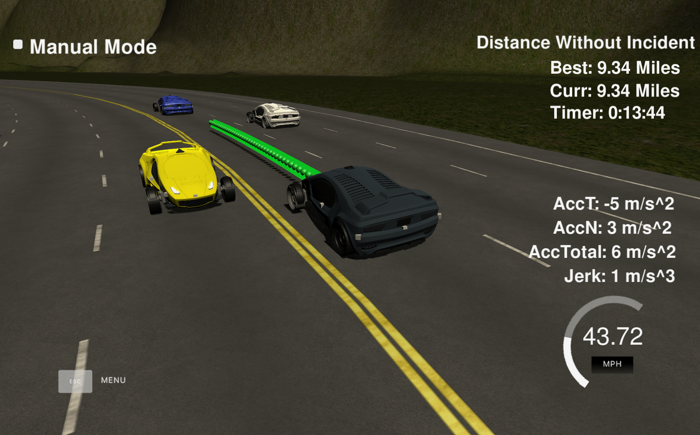
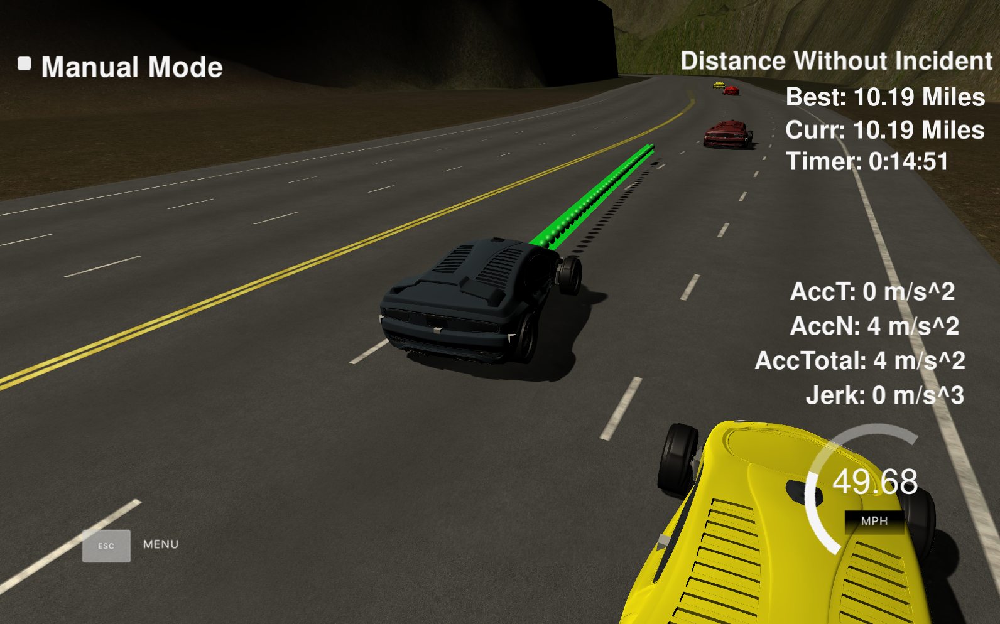

# Path Planning Project
Udacity Self-Driving Car Engineer Nanodegree Program
---
## Overview
Path planning is a critical, complex and principal module in a self-driving vehicle, since it covers a wide range of components in autonomous car ranging from the low level actuators, sensor, to the localization and prediction modules. One other obivous component is a trajectory generator that can compute a candidate trajectory to be evaluated by the planner. In this project, the objective is to design a path planner that is able to create smooth, safe paths for the car to follow along a 3 lane highway with traffic. The car must not violate a set of motion constraints named maximum velocity, maximum acceleration, maximum jerk while avoiding collision with other vehilces in the highway. Lane change is applicable a and necessary to maintained the car's speed close to the maximum allowable speed. 

### Simulator.
You can download the Term3 Simulator which contains the Path Planning Project from the [releases tab (https://github.com/udacity/self-driving-car-sim/releases/tag/T3_v1.2).  

To run the simulator on Mac/Linux, first make the binary file executable with the following command:
```shell
sudo chmod u+x {simulator_file_name}
```

## Basic Build Instructions

1. Clone this repo.
2. Make a build directory: `mkdir build && cd build`
3. Compile: `cmake .. && make`
4. Run it: `./path_planning`.

## Dependencies

* cmake >= 3.5
* make >= 4.1
* gcc/g++ >= 5.4
* [uWebSockets](https://github.com/uWebSockets/uWebSockets)

## Project Explanation

Here is the data provided from the Simulator to the C++ Program.

#### The map of the highway is in data/highway_map.txt

Each waypoint in the list contains  [x,y,s,dx,dy] values. x and y are the waypoint's map coordinate position, the s value is the distance along the road to get to that waypoint in meters, the dx and dy values define the unit normal vector pointing outward of the highway loop.

The highway's waypoints loop around so the frenet s value, distance along the road, goes from 0 to 6945.554.

#### Main car's localization Data (No Noise)

| **Input** | Definition |
|:---------:|:---------:|
| x | Car's x position in map coordinates |
| y | Car's y position in map coordinates |
| s | Car's s position in frenet coordinates |
| d | Car's d position in frenet coordinates |
| yaw | Car's yaw angle in the map |
| speed | Car's speed in MPH|

#### Previous path data given to the Planner

| **Input** | Definition |
|:---------:|:---------:|
| previous_path_x | Previous list of x points previously given to the simulator |
| previous_path_y | Previous list of y points previously given to the simulator |

#### Previous path's end s and d values 

| **Input** | Definition |
|:---------:|:---------:|
| end_path_s | Previous list's last point's frenet s value |
| end_path_d | Previous list's last point's frenet d value |

#### Sensor Fusion Data, a list of all other car's attributes on the same side of the road. (No Noise)

["sensor_fusion"] A 2d vector of cars and then that car's [car's unique ID, car's x position in map coordinates, car's y position in map coordinates, car's x velocity in m/s, car's y velocity in m/s, car's s position in frenet coordinates, car's d position in frenet coordinates. 

## Details

1. The car uses a perfect controller and will visit every `(x,y)` point it recieves in the list every `.02 seconds`. The units for the `(x,y)` points are in meters and the spacing of the points determines the speed of the car. The vector going from a point to the next point in the list dictates the angle of the car. Acceleration both in the tangential and normal directions is measured along with the jerk, the rate of change of total Acceleration. The `(x,y)` point paths that the planner recieves should not have a total acceleration that goes over `10 m/s^2`, also the `jerk` should not go over `50 m/s^3`.

2. There will be some latency between the simulator running and the path planner returning a path, with optimized code usually its not very long maybe just 1-3 time steps. During this delay the simulator will continue using points that it was last given, because of this its a good idea to store the last points you have used so you can have a smooth transition. `previous_path_x`, and `previous_path_y` can be helpful for this transition since they show the last points given to the simulator controller with the processed points already removed. Either it is possible to return a path that extends this previous path or make sure to create a new path that has a smooth transition with this last path.

## Project Instructions and [Rubric points](https://review.udacity.com/#!/rubrics/1971/view) 

1. **Compilation**

The submitted code compiles without error with `emake` and `make`. It generated the path_panning binary code that will be excutable with no error.

2. **Valid Trajectories**

In order to demonstrate that my project meets the Rubic Points' requirements, the following screenshot of the running simulation is shown. As it can be noticed my algorithm has driven the car in the simulator for more than 1.5 lap with no constraint violation. The first image shows how the car is driving in a lane  where the second image whows how the car is changing the lane with maximum speed and yet respecting all the imposed constraints.

in short, all criteria in this rubic point is met as follows:

* The car drives within the speed limit
* Max Acceleration and Jerk are not exceeded
* No collisions
* The car keeps the current lane till it finds an opportunity to make lane change and reach higher speed
* The car is able to change lanes






3. **Reflection**

Based on the provided code, the path planning algorithms is mainly written in src/main.cpp. The code is written modular addressing distinct functions. The code consists of prediction, behavior planning and trajectory generation. 

##### Prediction

Predictin function deals with the telemetry and sensor fusion data to decided whether a car is ahead, to the right or left of the ego vehicle. [line 108 to line 155](./src/main.cpp#L108) in `main.cpp` is the correponding part to the prediction step.

##### Behavior Planning

Bhevior planning in this project decides between the following decisions when a car is in front of the ego car:

- Lane change?
- Speed up / speed down?

Based on the data from the prediction step, the behavior planning step increases/decreases the speed, ot make lane change when it is safe. [line 158 to line 188](./src/main.cpp#L158) in `main.cpp` is the correponding part to the prediction step.

##### Trajectory generation

This code does the calculation of the trajectory based on the speed and lane output from the behavior planning, car coordinates and past path points. [line 190 to line 306](./src/main.cpp#L190) are the parts in `main.cpp` code corresponding to the trajectory generation step. In order to ensure more continuity on the trajectory, the past trajectory points are copied to the new trajectory. The points are calculated by evaluating the spline and transforming the output coordinates to not local coordinates. Speed change is reasoned in the behavior part of the code, but it is used in this part to increase/decrease speed on every trajectory points instead of doing it for the complete trajectory.


